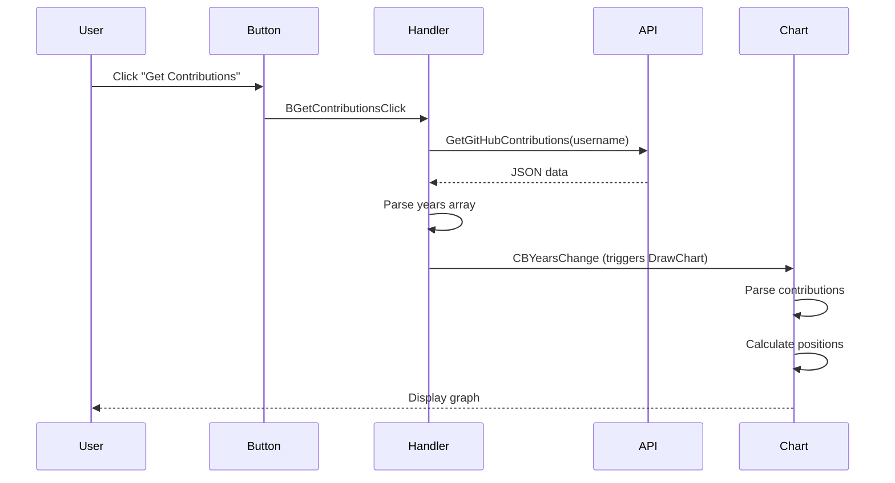

## Application Architecture

The GitHub Contributions Chart follows a single-form VCL architecture with clear separation between UI, data fetching, and rendering logic.

<Frame>
  ```mermaid
  graph TD
    A[Program Entry] --> B[TForm1 Creation]
    B --> C[FormCreate Event]
    C --> D[UI Initialized]
    D --> E[User Enters Username]
    E --> F[BGetContributions Click]
    F --> G[Fetch GitHub Data]
    G --> H[Parse JSON]
    H --> I[DrawChart]
    I --> J[Render Contributions]
  ```
</Frame>

## Main Program Entry Point

The application starts in `GitHubContributions.dpr:10-14`:

```pascal
begin
  Application.Initialize;
  Application.MainFormOnTaskbar := True;
  Application.CreateForm(TForm1, Form1);
  Application.Run;
end.
```

This is the standard VCL application initialization pattern:
1. **Initialize** - Sets up the application object
2. **MainFormOnTaskbar** - Makes the form appear on the Windows taskbar
3. **CreateForm** - Instantiates the main form (`TForm1`)
4. **Run** - Starts the message loop

## TForm1 Class Structure

The main form class is defined in `Unit1.pas:16-40`:

### Visual Components

<CardGroup cols={2}>
  <Card title="Input Controls" icon="keyboard">
    - `EUsername: TEdit` - Username input field
    - `CBYears: TComboBox` - Year selector
    - `CBFirstDayOfWeek: TComboBox` - Week start selector
  </Card>
  
  <Card title="Action Controls" icon="hand-pointer">
    - `BGetContributions: TButton` - Fetch data button
    - `BTheme: TButton` - Theme toggle button
  </Card>
  
  <Card title="Layout Components" icon="table-columns">
    - `Panel1: TPanel` - Top control panel
    - `Panel2: TPanel` - Options panel
  </Card>
  
  <Card title="Chart Components" icon="chart-simple">
    - `Chart1: TChart` - Main TeeChart component
    - `Series1: TPointSeries` - Contribution data points
    - `ChartTool1: TMarksTipTool` - Hover tooltips
  </Card>
</CardGroup>

### Event Handlers

The form responds to five key events:

```pascal
procedure FormCreate(Sender: TObject);
procedure BGetContributionsClick(Sender: TObject);
procedure CBYearsChange(Sender: TObject);
procedure CBFirstDayOfWeekChange(Sender: TObject);
procedure BThemeClick(Sender: TObject);
```

### Private Methods

```pascal
procedure DrawChart;
```

The `DrawChart` method is the core rendering logic that updates the chart visualization.

## Key Procedures and Functions

### 1. FormCreate - Initialization

Location: `Unit1.pas:285-319`

This event handler runs when the form is first created:

```pascal
procedure TForm1.FormCreate(Sender: TObject);
var
  i: Integer;
begin
  EUsername.Text := 'sallar';  // Default username
  CBYears.Enabled := False;
  CBFirstDayOfWeek.Enabled := False;

  // Chart configuration
  Chart1.Hide;
  Chart1.AllowZoom := False;
  Chart1.AllowPanning := pmNone;
  Chart1.MarginTop := 20;
  Chart1.MarginLeft := 7;

  // Series styling
  Series1.Pointer.Pen.Hide;
  Series1.Pointer.Selected.Hover.Pen.Color := clBlack;
  Series1.Pointer.Selected.Hover.Pen.Width := 1;
  Series1.Pointer.Size := 6;

  // Create month annotations
  SetLength(monthTitles, 12);
  for i := 0 to Length(monthTitles)-1 do
  begin
    monthTitles[i] := TAnnotationTool(Chart1.Tools.Add(TAnnotationTool));
    monthTitles[i].Shape.Transparent := True;
    monthTitles[i].Active := False;
  end;

  // Create day annotations (Mon, Wed, Fri)
  SetLength(dayTitles, 3);
  for i := 0 to Length(dayTitles)-1 do
  begin
    dayTitles[i] := TAnnotationTool(Chart1.Tools.Add(TAnnotationTool));
    dayTitles[i].Shape.Transparent := True;
    dayTitles[i].Active := False;
  end;
end;
```

<Note>
  The form creates 12 month labels and 3 day labels (for alternating weekdays) as annotation tools on the chart.
</Note>

### 2. BGetContributionsClick - Data Fetching

Location: `Unit1.pas:74-107`

```pascal
procedure TForm1.BGetContributionsClick(Sender: TObject);
var
  iterator: TJSONIterator;
  years: TJSONArray;
begin
  Screen.Cursor := crHourGlass;  // Show loading cursor
  CBYears.Enabled := False;
  CBYears.Clear;

  // Fetch contributions from API
  gitHubContributions := GetGitHubContributions(EUsername.Text);

  // Extract available years
  if not gitHubContributions.TryGetValue<TJSONArray>('years', years) then
    Exit;

  // Populate year dropdown
  iterator := TJSONIterator.Create(TJsonObjectReader.Create(years));
  while iterator.Next do
  begin
    iterator.Recurse;
    iterator.Next;
    CBYears.Items.Add(iterator.AsString);
    iterator.Return;
  end;

  if CBYears.Items.Count > 0 then
  begin
    CBYears.Enabled := True;
    CBYears.ItemIndex := 0;
    CBYearsChange(Self);  // Trigger chart drawing
    CBFirstDayOfWeek.Enabled := True;
  end;

  Screen.Cursor := crDefault;
end;
```

**Flow**:
1. Disable controls and show loading cursor
2. Call `GetGitHubContributions()` to fetch data
3. Parse the `years` array from JSON response
4. Populate the year dropdown
5. Trigger initial chart rendering

### 3. DrawChart - Core Rendering Logic

Location: `Unit1.pas:180-273`

This is the most complex procedure, responsible for rendering the contribution graph:

```pascal
procedure TForm1.DrawChart;
var
  targetYear, tmpWeek, tmpDay, tmpIntensity: Integer;
  tmpYear: Word;
  tmpDate: TDateTime;
  tmpDateStr, tmpIntensityStr: string;
  contributions: TJSONArray;
  iterator: TJSONIterator;
  tmpFormatSettings: TFormatSettings;
begin
  Series1.Clear;
  Series1.Visible := False;

  // Configure date format for parsing
  tmpFormatSettings := FormatSettings;
  tmpFormatSettings.ShortDateFormat := 'yyyy-mm-dd';

  // Validate data
  if (gitHubContributions = nil) or
     (not gitHubContributions.TryGetValue<TJSONArray>('contributions', contributions)) then
    Exit;

  if not TryStrToInt(CBYears.Items[CBYears.ItemIndex], targetYear) then
    Exit;

  // Iterate through contributions
  iterator := TJSONIterator.Create(TJsonObjectReader.Create(contributions));
  while iterator.Next do
  begin
    iterator.Recurse;
    tmpDateStr := '';
    tmpIntensityStr := '';
    
    // Extract date and intensity from each contribution
    while iterator.Next do
    begin
      if iterator.Key = 'date' then
        tmpDateStr := iterator.AsString
      else if iterator.Key = 'intensity' then
        tmpIntensityStr := iterator.AsString;
    end;
    iterator.Return;

    // Parse and validate
    if (tmpDateStr = '') or not TryStrToDate(tmpDateStr, tmpDate, tmpFormatSettings) then
      Continue;
    if (tmpIntensityStr = '') or not TryStrToInt(tmpIntensityStr, tmpIntensity) then
      Continue;
    if YearOf(tmpDate) <> targetYear then
      Continue;

    // Calculate week and day position
    CustomWeekDayOfTheYear(tmpDate, CBFirstDayOfWeek.ItemIndex, tmpWeek, tmpDay);

    // Add point to series
    Series1.AddXY(tmpWeek, 7-tmpDay, FormatMark(tmpDate), IntensityThemeColor(tmpIntensity));
  end;

  Series1.Visible := True;
  Chart1.Show;
  Chart1.Draw;

  // Position month labels
  for var m := 0 to Length(monthTitles)-1 do
  begin
    tmpDate := EncodeDate(targetYear, m+1, 1);
    with monthTitles[m] do
    begin
      Active := True;
      Text := TFormatSettings.Invariant.ShortMonthNames[MonthOf(tmpDate)];
      Top := 8;
      tmpWeek := WeekOfTheYear(tmpDate, tmpYear);
      if tmpYear = targetYear-1 then
        tmpWeek := 1;
      Left := Chart1.Axes.Bottom.CalcPosValue(tmpWeek);
    end;
  end;

  // Position day labels
  for var d := 0 to Length(dayTitles)-1 do
  begin
    with dayTitles[d] do
    begin
      Active := True;
      Text := TFormatSettings.Invariant.ShortDayNames[(d+1)*2 + 1-CBFirstDayOfWeek.ItemIndex];
      Left := 10;
      Top := Chart1.Axes.Left.CalcPosValue(6-(d*2) -1) - Abs(Font.Height div 2);
    end;
  end;
end;
```

<Info>
  The Y-axis is inverted (`7-tmpDay`) to match GitHub's visual layout where Sunday/Monday appears at the top.
</Info>

### 4. BThemeClick - Theme Switching

Location: `Unit1.pas:145-173`

```pascal
procedure TForm1.BThemeClick(Sender: TObject);
begin
  // Toggle theme
  if BTheme.Caption = 'Dark' then
  begin
    currentTheme := GithubDarkTheme;
    BTheme.Caption := 'Light';
  end
  else
  begin
    currentTheme := StandardTheme;
    BTheme.Caption := 'Dark';
  end;

  // Apply theme to form
  Self.Color := currentTheme.Background;
  Self.Font.Color := currentTheme.Text;
  EUsername.Color := currentTheme.Background;
  CBYears.Color := currentTheme.Background;
  CBFirstDayOfWeek.Color := currentTheme.Background;

  Chart1.Color := currentTheme.Background;

  // Update label colors
  for var i := 0 to High(monthTitles) do
    monthTitles[i].Shape.Font.Color := currentTheme.Text;

  for var i := 0 to High(dayTitles) do
    dayTitles[i].Shape.Font.Color := currentTheme.Text;

  DrawChart;  // Redraw with new colors
end;
```

## Global Variables

Defined in `Unit1.pas:49-53`:

```pascal
var
  gitHubContributions: TJSONObject;     // Cached API response
  monthTitles: TArray<TAnnotationTool>; // Month labels (12 items)
  dayTitles: TArray<TAnnotationTool>;   // Day labels (3 items)
  currentTheme: TTheme;                 // Active theme
```

<Warning>
  These module-level variables maintain state across the application lifetime. The `gitHubContributions` object should be freed when the form closes to prevent memory leaks.
</Warning>

## Component Wiring

The components are connected through event handlers defined in the form's DFM file:

```pascal
object BGetContributions: TButton
  Caption = 'Get Contributions'
  OnClick = BGetContributionsClick  // Wired to fetch handler
end

object CBYears: TComboBox
  OnChange = CBYearsChange  // Triggers chart redraw
end

object CBFirstDayOfWeek: TComboBox
  OnChange = CBFirstDayOfWeekChange  // Also triggers redraw
end

object BTheme: TButton
  Caption = 'Dark'
  OnClick = BThemeClick  // Toggles theme
end
```

### Event Flow Diagram



## Initialization and Cleanup

The unit includes an initialization section (`Unit1.pas:321-322`):

```pascal
initialization
  CurrentTheme := StandardTheme;
end.
```

This ensures the light theme is active when the application starts.

<Note>
  Consider adding a finalization section to free the `gitHubContributions` object if it's still allocated.
</Note>

## Best Practices Observed

<CardGroup cols={2}>
  <Card title="Cursor Feedback" icon="hourglass">
    Shows hourglass cursor during network operations for better UX
  </Card>
  
  <Card title="Safe JSON Parsing" icon="shield-check">
    Uses `TryGetValue` and `TryStrToInt` to safely handle malformed data
  </Card>
  
  <Card title="Iterator Pattern" icon="arrows-rotate">
    Uses `TJSONIterator` for efficient JSON traversal
  </Card>
  
  <Card title="Separation of Concerns" icon="layer-group">
    Theme logic is isolated in `Themes.pas` unit
  </Card>
</CardGroup>

## Next Steps

<CardGroup cols={2}>
  <Card title="API Reference" icon="book" href="./api-reference">
    Explore detailed documentation for all functions and types
  </Card>
  <Card title="Development Setup" icon="wrench" href="./setup">
    Learn how to set up your development environment
  </Card>
</CardGroup>